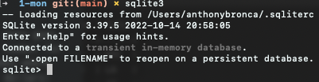

# Structured Query Language

Structured Query Language, or SQL for short,  is a language intended to be used for data and databases. It is pronounced as "Sequel" or "S-Q-L". It has its own syntax and way or processing the code, so it is important to be very vigiliant on syntax.

SQL is a declarative langauge (unlike JS which is a programming language), and this means you tell it to do something and it does. There are no for...loops or variable declaration. It is simply just tables of data, and plugging information in.

Think of this scenario:

You are tasked with managing the accounts of residents at a property. You have to balance the budget and make sure that everyone is in good-standing. You could easily do this with Excel or Google sheets. So how would you start? you create a table or two, add some columns, and then fill in data for those columns. It may look something like this:

| First_Name | Unit_Number | Rent | Due |
|------|-------------|------|-----|
| John | 25          | 1000 |  0  |
| Jane | 30          | 1500 | 1000|
| Alex | 22          | 2000 | 20.05|


Notice, that for this data to work we would need to be very strict about what type of data goes in to each column. A string for a name, some whole number for unit_number, some whole number for rent, and some decimal number for amount due. It would be chaotic to start putting names where total due goes, or if we had rent mixed up with due amount. Could cost us millions of dollars!

So, yeah we can do this with Excel and Google sheets, but we can also do this with SQL. We will be using `Sqlite3` as our software to store data. To do this, we can open the Sqlite3 database running:

```sh
sqlite3
```
(you could create an alias for this to avoid having to type the 3)

you should see something like this:



Now, we need to determine the shape our data tables.

First_Name - Let's do a string of up to 30 characters, -> Varchar(30)
Unit_Number - Some sort of whole number -> Integer
Rent - A whole number again -> Integer
Due - A number with floating point -> Float(precision, scale)

We will also want to have an `id`. `id` is useful for speeding up the query and generating a relationship between tables. `id`s can not be reused within the same table, and will need to be a `Primary Key` as well as have `Autoincrement` functionality. We can run this in our `sqlite` shell to create this table:


## Creating a table
```sql
CREATE TABLE tenants (
id INTEGER PRIMARY KEY AUTOINCREMENT,
first_name VARCHAR(30),
unit_number INTEGER,
rent INTEGER,
due FLOAT(2, 10)
);
```
Before we run this, let's consider our data again. What happens if a user tries to add a tenant but forgets to pass in a name, or a unit number, or rent? It would work, and that would be chaos! We can use the `NOT NULL` contraint to protect against this. Here is the code refactored:

```sql
CREATE TABLE tenants (
id INTEGER PRIMARY KEY AUTOINCREMENT,
first_name VARCHAR(30) NOT NULL,
unit_number INTEGER NOT NULL,
rent INTEGER NOT NULL,
due FLOAT(2, 10) NOT NULL
);
```

Lastly, let us notice some syntax points

1. SQL Command should be capitalized.
2. Notice the space between the table name and the parenthesis
3. We use a parenthesis to create a table and not curly braces
4. We seperate each line item with commas
5. WE MUST END LINES WITH SEMICOLONSSSSS

Once you run this, you will now have a table in your database! Yay! We can check this in sqlite by running`.tables`. If you'd like to see the blueprint for this table you can use `.schema tenants`

Alright, so we have a table but there is no data! Let's now insert some data

## Inserting into a table
```sql
INSERT INTO tenants VALUES (
    1,
    "Anthony",
    300,
    1000,
    0.00
);

```

For fun, let's add a few more tenants:

```sql
INSERT INTO tenants (first_name, unit_number, rent, due)
VALUES ("Sam",310,1200,500);

INSERT INTO tenants (first_name, unit_number, rent, due)
VALUES (
    "Will",
    400,
    2000,
    2000
);

-- adding a differe 'will' with different rent for later --

INSERT INTO tenants (first_name, unit_number, rent, due)
VALUES (
    "Will",
    400,
    1000,
    0
);

```


Now, we can check to see if this data was inserted by running more SQL!

## Selecting from a table
```sql
SELECT * FROM tenants;
```
And success!

We can also make this search query a little more specific. What if we wanted to search for all tenants who have rent greater than $1,000 dollars? We can use the `WHERE` clause to do this.

```sql
SELECT * FROM tenants WHERE rent > 1000;
```

## Updating Data

Okay, so we can Create tables and add data. We can also view data. So how do we update it? It is time to process some payments! We can do this using the `UPDATE` command, and utilizing `SET` to reassign values within a specified column. Don't forget to be specific with `WHERE` you want to update. Here, let's just update everyone who has a balance due greater than 0 to now be paid off

```sql
UPDATE tenants SET due = 0 WHERE due > 0;
```

## Deleting Data

And our tenant, Sam, is moving out 🙁. We need to remove him from the tenants table using `DELETE`. We want to make sure not to delete our other tenants!

```sql
DELETE FROM tenants WHERE first_name="Sam";
```


## Reading a SQL file

Alright, so SQL can be a little finicky. It isn't so fun to just run these in the SQLITE terminal shell. What happens if we need to redo something, fix a typo, or even study our previous code?

To fix this, we can just write all of our SQL in a .sql file. We can then have sqlite3 read it so that it executes all the SQL inside of it. Try it out running the `.read` command on the .sql file located in this directory.

First, we need to open up our sqlite shell and name the database we want to create

```sh
sqlite3 users.db
```

Then, we can run the `.read` command on a .sql file

```
.read test.sql
```

Lastly, we want to make sure everything ran. We can use the `SELECT *` on a table,`.tables`, or `.schema` to check

```sql
SELECT * FROM users;
```
OR

`.schema`

OR

`.tables`


> ADVANCED MODE
Okay, lets get more advanced!

Notice we had to add something for every field. Kind of annoying! We can set default values using `DEFAULT`

In a new table called updated_tenant we will see the difference

```sql
CREATE TABLE tenants (
id INTEGER PRIMARY KEY AUTOINCREMENT,
first_name VARCHAR(30) NOT NULL,
unit_number INTEGER NOT NULL,
rent INTEGER NOT NULL,
due FLOAT(2, 10) NOT NULL DEFAULT 0.00
);

```

P.S, because of the PRIMARY KEY constraint, we also don't have to pass in an id everytime

Let's now test out our `DEFAULT` by inserting another tenant without passing in the due field

```sql
INSERT INTO tenants (first_name, unit_number, rent)
VALUES ("Bill", 400, 1200);
```

Now, we are working with data. DATA IS EXPENSIVE! You do not want to be deleting, inserting, or making any modifications all willy-nilly! What happens on the day you have a typo, or accidentally press enter too soon and delete everything! It happens way more often than you think. It is good practice to use `TRANSACTIONS`. This is a way for SQL to store some sort of memory of your changes. Think of this like git. We can start a transaction, make some changes, and if we are happy with our changes we can `COMMIT` them. If we realized we are about to get fired due to some major error, we can `ROLLBACK` and act like we never accidentally dropped the database 😄


```sql
BEGIN TRANSACTION;

DROP TABLE tenants;

-- Check to make sure we deleted it --

SELECT * FROM tenants;

-- If we want to revert our change we run: --

ROLLBACK;

-- if we want to keep that change we run: --

COMMIT TRANSACTION;

```
