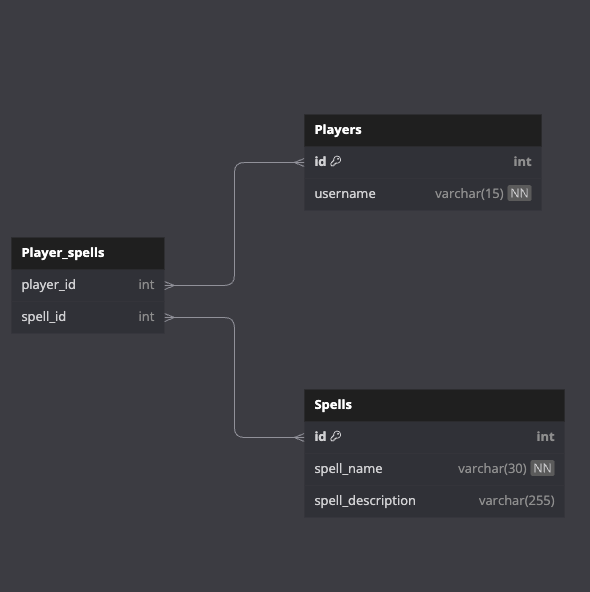

## Primary Key - PK

The unique identifier for the table. Never duplicated, auto-incremented.

- Most often integers, but don't have to be
- Integers allow for AUTOINCREMENT and fast lookup

## Foreign Key - FK

The identifier for **_another_** table.

- Syntax convention: <singular form of foreign table>_<PK of foreign table> eg. user_id
- Technically doesn't have to be the other table's PK
- References the PK in another table for easy lookup
- How we create this reference depends on the type of relationship

```sql
-- syntax
FOREIGN KEY (fk_name_in_this_table) REFERENCES otherTableName(pk_from_that_table)
```

## One-To-One

A single instance of data from one table is only related to a single instance of data from a different table.

Not very commonly used, but can be useful in rare cases.

Think: A single user may have a single choice of light mode or dark mode

## One-To-Many

A single instance of data from one table is related to multiple instances of data from a different table.

Think:

- One person can have many pets, each pet can only have one owner
- One classroom can have many desks, each desk can only belong to one classroom
- One tree can have many leaves, each leaf can only belong to one tree

```sql
CREATE TABLE trees (
  id INTEGER PRIMARY KEY AUTOINCREMENT
);

CREATE TABLE leaves (
  id INTEGER PRIMARY KEY AUTOINCREMNT,
  tree_id INTEGER,
  FOREIGN KEY (tree_id) REFERENCES trees(id)
);
```

## Many-To-Many

Multiple instances of data from one table can relate to multiple instance of data from a different table.

When we use this form of relationship, a **_join table_** is required. A join table only holds the PK's of each table to use as a reference.

Think:

- Every student belongs to many classrooms, every classroom has many students
- Every road has many cars driving on it, every car drives on many roads
- Every COD player can use many weapons, every weapon can be used by many players

```sql
CREATE TABLE elden_ring_players (
  id INTEGER PRIMARY KEY AUTOINCREMENT
);

CREATE TABLE weapons (
  id INTEGER PRIMARY KEY AUTOINCREMENT
);

CREATE TABLE player_weapon (
  player_id INTEGER,
  weapon_id INTEGER,
  FOREIGN KEY (player_id) REFERENCES elden_ring_players(id)
  FOREIGN KEY (weapon_id) REFERENCES weapons(id)
);
```

## Database Design - Normalization

Normalizing a database ensures it's being as efficient as possible. When designing a database, consider these rules

- First normal form

  - Remove repeats within a single table
  - Create different tables for each related piece of data
  - Set a PK for each table

- Second normal form

  - Create a different table for value sets that apply to multiple tables
  - Relate tables with FK

- Third normal form

  - Remove anything that isn't dependant on the PK

## Some basic SQL rules/guidelines

- Table names should be plural, joins tables should be singular

- Semi-colon required at the end of commands;

- Use single quotes instead of double quotes for string values

- No spaces in names, use_underscores instead of camelCase


----------------------------------------------------------
> Lecture References

## DBDiagrams

- Twitter example:
code:
```
Table Users {
  id int [pk, increment] // auto-increment
  first_name varchar (30) [not null]
  last_name varchar (30) [not null]
  email varchar (55) [not null, unique]
  username varchar(15) [not null, unique]
}

Table Posts {
  id int [pk, increment]
  post varchar(180) [not null]
  user_id int [ref: > Users.id]
  created_at timestamp
}
```


- Video game example:
code:

```
Table Players {
  id int [pk, increment]
  username varchar(15) [not null, unique]
}

Table Spells {
  id int [pk, increment]
  spell_name varchar(30) [not null, unique]
  spell_description varchar(255)
}

TABLE Player_spells {
  player_id int
  spell_id int
}

Ref: "Players"."id" <> "Player_spells"."player_id"

Ref: "Spells"."id" <> "Player_spells"."spell_id"
```



- Light mode
code:
```
TABLE User {
  id int [pk, increment]
}

TABLE Settings {
  id int [pk, increment]
  dark_mode bool [not null]
}

Ref: "User"."id" - "Settings"."id"
```

